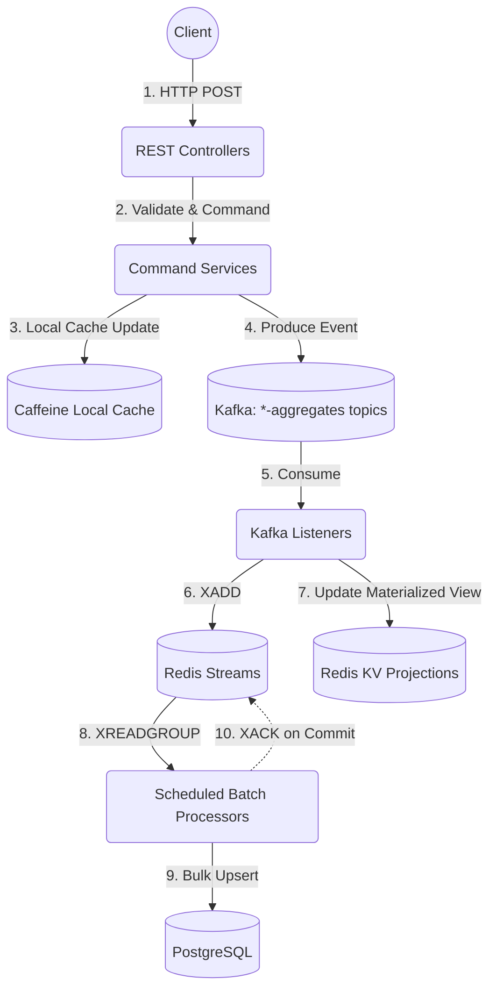

-hi# ARCHITECTURE: High-Throughput Event-Driven CQRS

This application (`boot-high-rps-sample`) demonstrates an ultra-high-throughput, event-driven CQRS architecture. It completely decouples the synchronous HTTP command path from the relational database to achieve maximum performance and resilience.

## Core Architectural Principles

1. **No Synchronous DB Blocking**: The command path (write operations) strictly avoids writing to PostgreSQL synchronously.
2. **Kafka as the Immediate Ledger**: State mutations are validated and published directly to Kafka (`acks=all`, idempotence enabled) as the immediate durable ledger. 
3. **Direct-To-Aggregates Publishing**: The application writes events directly to entity-specific Kafka aggregate topics (e.g., `authors-aggregates`), bypassing intermediate processing for maximum speed.
4. **At-Least-Once Materialization**: Kafka listeners consume events, hand them off to Redis Streams (`XADD`) for durable queueing, and acknowledge the Kafka offset only after the Redis write succeeds.
5. **Bulk Upsert Batching**: Scheduled processors read from Redis Streams (`XREADGROUP`), execute natural-key upserts against PostgreSQL in bulk, and acknowledge (`XACK`) only after the DB transaction commits.

## Architecture Data Flow

## Detailed CQRS Implementation

### Command Side (Writes)
The Command side handles state changes at thousands of RPS by bypassing the database.
- **Service Pattern**: Commands (e.g., `AuthorCommandService`) acquire distributed reservations (Redis) to prevent duplicate creation, then immediately publish domain events (e.g., `AuthorCreatedEvent`) directly to Kafka.
- **Local Consistency**: Once the Kafka publish is acknowledged by the broker, the local caffeine cache is proactively updated for read-your-own-writes consistency.
- **Resilience**: Bounded publish timeouts prevent thread exhaustion if brokers fail. The system gracefully returns HTTP 503 instead of 500 when Kafka is unreachable (`KafkaPublishPendingException`), tested robustly with Toxiproxy network disruption injection.

### Query Side (Reads)
The Query side serves data from highly optimized read models.
- **Layered Caching Strategy**:
  1. **Caffeine**: Ultra-fast, localized in-memory cache, updated synchronously during writes.
  2. **Redis**: Distributed materialized view (updated directly by the Kafka-to-Redis listeners).
  3. **PostgreSQL**: Source of truth fallback and interactive query target.

## Fault Tolerance & Reliability Patterns

1. **Dead Letter Queues (DLQ)**: Deserialization failures (via `ErrorHandlingDeserializer`) and business-logic errors automatically route to a resilient Redis-backed DLQ system.
2. **Circuit Breakers**: `Resilience4j` Circuit Breakers and Bulkheads wrap the Redis projections and database batch writes to halt processing gracefully during backend degradation.
3. **Idempotency via Natural Keys**: Because `ScheduledBatchProcessor` operations use natural-key `upserts`, redelivery caused by a crash between the database write (Step 9) and the Redis `XACK` (Step 10) is completely safe.
4. **Graceful Deletions**: Deletions are processed as Tombstone events, with unified logic managed by `DeletionMarkerHandler`.
5. **Strict Commit Semantics**: Auto-commit is disabled (`enable-auto-commit=false`). Manual acks are only issued *after* the durable handoff to Redis Streams, ensuring zero data loss during rebalances.

## Observability & Configuration

- **Structured Configuration**: Type-safe Spring Boot `@ConfigurationProperties` drive all parameters, making environments easily tunable.
- **MDC Propagation**: Correlation IDs are generated at the HTTP layer (`CorrelationIdFilter`) and propagated natively across thread and network boundaries as Kafka headers via an `MdcProducerInterceptor`.
- **OpenTelemetry (OTel)**: Metrics, consumer lags, and distributed traces are seamlessly exported to a Grafana/Prometheus (LGTM) stack.
