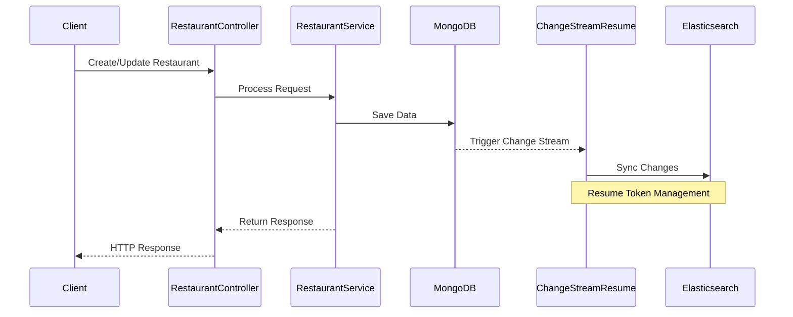
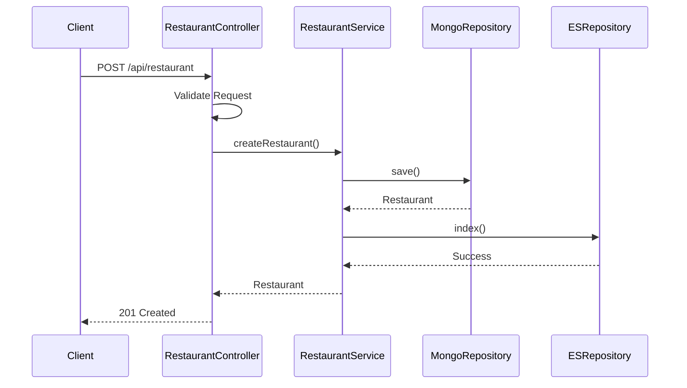
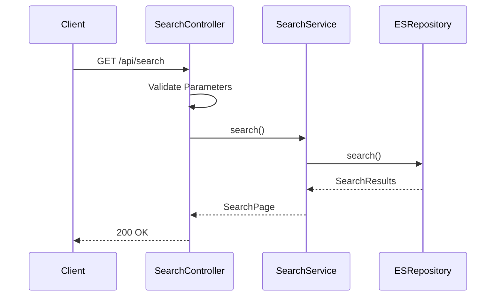
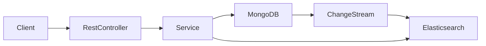

# Spring Boot Reactive MongoDB and Elasticsearch Integration

A reactive Spring Boot application demonstrating seamless integration between MongoDB and Elasticsearch, featuring real-time search capabilities including geospatial queries, full-text search, and aggregations.

---

## Highlights

- **Reactive Streams Approach**: Uses Spring Data’s reactive driver for both MongoDB and Elasticsearch.
- **Advanced Queries**: Demonstrates geospatial searches, text-indexed searches, and filtering in near real-time.
- **Scalable Architecture**: Docker-compose-based environment for local testing.

---

## Architecture

The application follows a reactive architecture pattern using Spring WebFlux:


---

## Key Features
- Reactive API endpoints using Spring WebFlux and reactive drivers
- **Real-time Synchronization**: MongoDB change streams to Elasticsearch
- MongoDB for primary data storage
- Advanced Search Capabilities:
  - Full-text search
  - Geospatial queries
  - Aggregation operations
- Comprehensive validation
- Exception handling
- **API Documentation**: OpenAPI/Swagger UI integration

---

## Sequence Diagrams

### Restaurant Creation Flow


### Search Operation Flow

---

## Data Flow


---
## Configuration Notes

### MongoDB
- Uses replica set for change streams
- Transaction support with `ReactiveMongoTransactionManager`
- Default database: mongoes

## Getting Started

### Prerequisites
- JDK 21+
- Docker and Docker Compose
- Maven 3.9+

---

### Running Locally
1. Start the infrastructure:
```bash
docker compose -f docker/docker-compose.yml up -d
```

2. Run the application:
```bash
./mvnw spring-boot:run -Dspring-boot.run.profiles=local
```

### Running Tests
```bash
./mvnw clean verify
```

---

## API Documentation
- Swagger UI: http://localhost:8080/swagger-ui.html
- OpenAPI Spec: http://localhost:8080/v3/api-docs

## Monitoring
- Actuator: http://localhost:8080/actuator
- Prometheus: http://localhost:9090
- Grafana: http://localhost:3000 (admin/admin)

## Development Tools
- Kibana: http://localhost:5601/app/kibana#/dev_tools/console?_g=()
- Elasticsearch: http://localhost:9200
- Mongo Express: http://localhost:8081

## Useful Elasticsearch Commands
- Count documents: `GET /restaurant/_count`
- Search all: `GET /restaurant/_search`
- View mapping: `GET /restaurant/_mapping`

## Configuration Properties
Key application properties:
```properties
spring.data.mongodb.database=mongoes
spring.data.mongodb.uri=mongodb://localhost:27017/mongoes?replicaSet=rs0
spring.elasticsearch.uris=localhost:9200
spring.elasticsearch.socket-timeout=10s
```

## Exception Handling
The application includes global exception handling for:
- Validation errors
- Duplicate entries
- Resource not found
- General server errors

### Reference
- https://medium.com/geekculture/elastic-search-queries-hands-on-examples-fe5b2bc10c0e
