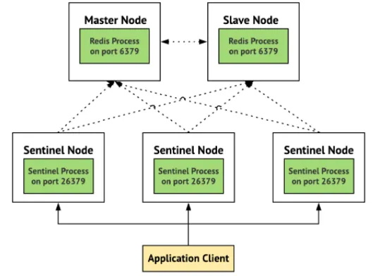

# Ultimate Redis Implementation


A comprehensive sample showcasing various Redis usage patterns, including sentinel architecture, advanced TTL management, and cluster connections.

## Redis Sentinel & High Availability

- Runs 1 master, 1 replica, and 3 sentinel instances via Docker Compose.
- **Quorum** Setting (defaults to 2) for failover decisions.

## ReadFrom Settings

 Configurable with Lettuce through application properties:

 ```yaml
 spring:
   redis:
     lettuce:
       read-from: REPLICA_PREFERRED
 ```

Available options: MASTER, REPLICA_PREFERRED, MASTER_PREFERRED, etc.

## Advanced Features

- Smart GZIP Compression with threshold-based serialization
- Pattern-based key operations for maintenance
- Redis Lua scripting support for complex atomic operations
- Rate limiting with token bucket algorithm
- Key expiry management with different TTLs for different caches
- Health check endpoint for monitoring Redis status

## Getting Started

### Start Redis Infrastructure
```shell
cd docker
docker-compose up -d
```

Or for Sentinel architecture:
```shell
cd docker
docker-compose -f docker-compose-sentinel.yml up -d
```

### Start the application with a specific profile
```shell
./mvnw spring-boot:run -Dspring-boot.run.profiles=sentinel
```

## View Keys using cli

Connect to redis-cli using below command
```shell
docker exec -it redis-server redis-cli
```

Run keys * command to view all keys
```shell
keys *
```

## Run the service
```shell
./mvnw spring-boot:run
```

## What it is / What it does
* A Spring Boot 3 Application
* Using @Cacheable, @CachePut, @CacheEvict to cache results of method invocations
* Use Redis to store the cached results
* Define different TTLs for different Caches
* Support for Lua scripting and atomic operations
* Performance metrics via Micrometer
* Health monitoring and status checks

## Redis Sentinel

**What is Redis Sentinel?**

Redis Sentinel is the high-availability solution for open-source Redis server. It provides monitoring of all Redis nodes and automatic failover should the master node become unavailable. This guide provides a sample configuration for a three-node Redis cluster. For additional details, see the official documentation [here](https://redis.io/docs/latest/operate/oss_and_stack/management/sentinel/).

* **_Monitoring_**: This is basically when sentinel checks if the master and slave instances are working as expected.
* **_Notification_**: This is when the sentinel notifies other programs or other system administrators via an API when there is something wrong with the monitoring instances.
* **_Automatic Failover_**: On a master failure, the sentinel promotes one of the slaves to become the new master and then makes the other additional slaves use the new master.



### **_Configuration_**

We will run 1 master,1 slave and 3 sentinel instance.

### **What is Quorum ?**

* The quorum is the number of Sentinels that need to agree about the fact the master is not reachable, in order to really mark the master as failing, and eventually start a failover procedure if possible.
* However, the quorum is only used to detect the failure. In order to actually perform a failover, one of the Sentinels need to be elected leader for the failover and be authorized to proceed. This only happens with the vote of the majority of the Sentinel processes.
* `REDIS_SENTINEL_QUORUM`: Number of Sentinels that need to agree about the fact the master is not reachable. Default: 2.

### ReadFrom

**MASTER**: Setting to read from the upstream only.

**MASTER_PREFERRED**: Setting to read preferred from the upstream and fall back to a replica if the master is not available.

**UPSTREAM**: Setting to read from the upstream only.

**UPSTREAM_PREFERRED**: Setting to read preferred from the upstream and fall back to a replica if the upstream is not available.

**REPLICA_PREFERRED**: Setting to read preferred from replicas and fall back to upstream if no replica is available.

**REPLICA**: Setting to read from the replica only.

**ANY**: Setting to read from any node.

We are using _REPLICA_PREFERRED_ in here but this configuration can be important in production!

### Reference
 - [Spring Boot 3 Redis Sentinel Guide](https://medium.com/@htyesilyurt/spring-boot-3-redis-sentinel-lettuce-client-and-docker-compose-for-high-availability-1f1e3c372a5a)
 - [Ultimate Guide to Redis Cache](https://programmerfriend.com/ultimate-guide-to-redis-cache-with-spring-boot-2-and-spring-data-redis/)
 - [Redis Lua Scripting](https://redis.io/docs/manual/programmability/eval-intro/)
