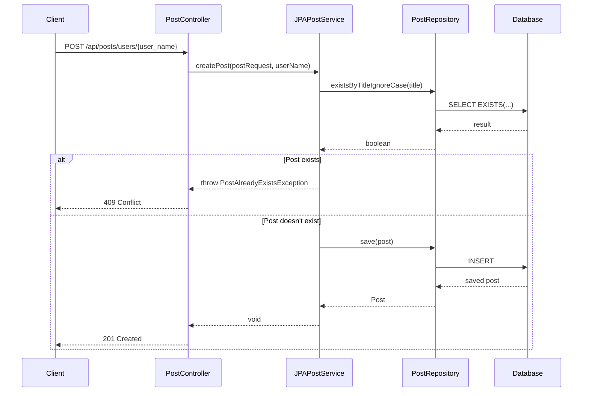
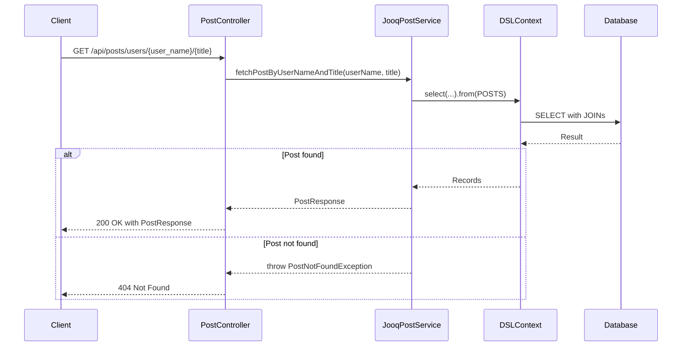

# Spring Boot JPA JOOQ Sample

This module demonstrates the usage of both JPA and JOOQ in a Spring Boot application for managing blog posts with comments and tags.

---
## Technologies Used

- Spring Boot
- Spring Data JPA
- JOOQ
- PostgreSQL
- OpenAPI (Swagger)

---
## API Endpoints

### Create Post
```http
POST /api/users/{user_name}/posts/
```
Request Body:
```json
{
  "title": "Sample Post",
  "content": "Post content here",
  "published": true,
  "publishedAt": "2024-01-20T10:00:00",
  "comments": [
    {
      "title": "Comment Title",
      "review": "Comment content",
      "published": true,
      "publishedAt": "2024-01-20T10:00:00"
    }
  ],
  "tags": [
    {
      "name": "tech",
      "description": "Technology related posts"
    }
  ]
}
```

### Get Post
```http
GET /api/users/{user_name}/posts/{title}
```
Response:
```json
{
  "title": "Sample Post",
  "content": "Post content here",
  "published": true,
  "publishedAt": "2024-01-20T10:00:00",
  "author": "user_name",
  "createdAt": "2024-01-20T10:00:00",
  "comments": [
    {
      "title": "Comment Title",
      "content": "Comment content",
      "published": true,
      "publishedAt": "2024-01-20T10:00:00"
    }
  ],
  "tags": [
    {
      "name": "tech",
      "description": "Technology related posts"
    }
  ]
}
```
---

## Sequence Diagrams

### Post Creation Flow (JPA)


### Post Retrieval Flow (JOOQ)

---

## Validation Rules

- Post title: Required, max 255 characters
- Post content: Required, max 10000 characters
- Comment title: Required, max 255 characters
- Comment review: Required, max 10000 characters
- Tag name: Required, 1-50 characters, alphanumeric with hyphens and underscores
- Tag description: Optional, max 200 characters

---

### Format code

This project uses Spotless to maintain consistent code formatting. Run the following command to format all files:

```shell
./mvnw spotless:apply
```

### Run tests

```shell
./mvnw clean verify
```

### Run locally

Ensure you have Docker and Maven installed. Then:

1. Start the required PostgreSQL database:

```shell
docker-compose -f docker/docker-compose.yml up -d
```

2. Run the application with the local profile (uses local database):

```shell
./mvnw spring-boot:run -Dspring-boot.run.profiles=local
```

### Using Testcontainers at Development Time

Testcontainers provides isolated, throwaway instances of the PostgreSQL database for testing.
This allows you to run the application without setting up a local database.

There are two ways to run the application with Testcontainers:

You can run `TestJpaJooqApplication.java` from your IDE directly.
Alternatively, use Maven:

```shell
./mvnw spring-boot:test-run
```

---

### Useful Links
* [Swagger UI](http://localhost:8080/swagger-ui.html) - API documentation and testing interface
* [Actuator Endpoints](http://localhost:8080/actuator) - Application monitoring and management
