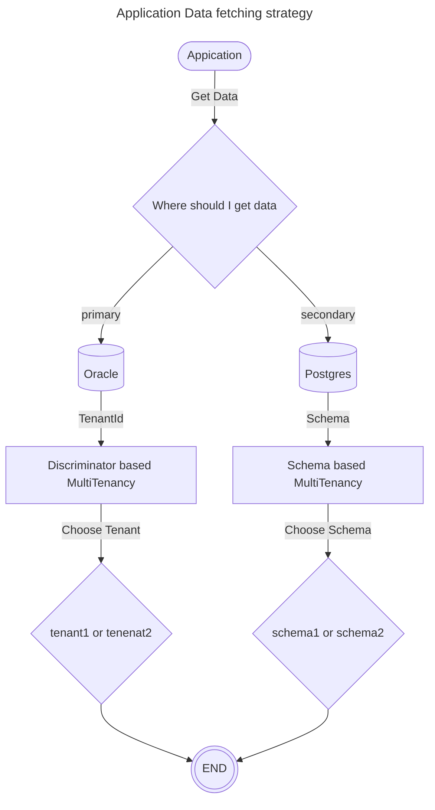

# Multi DataSource & MultiTenancy

Demonstrates a scenario where a single Spring Boot application connects to multiple databases and also implements multi-tenant logic (schema-based or DB-based).

---

### Application Flow


---

### How It Works
1. **Multiple DataSources**: Oracle for certain domain objects, Postgres for others.
2. **MultiTenancy**: Switches which schema or DB to use based on an incoming tenant identifier.
3. **TenantInterceptor**: Captures request-scope tenant info and sets it in the `TenantIdentifierResolver`.

---
### Run tests
`./mvnw clean verify`

### Run locally
```shell
docker-compose -f docker/docker-compose.yml up -d
./mvnw spring-boot:run -Dspring-boot.run.profiles=local
```


### Useful Links
* Swagger UI: http://localhost:8080/swagger-ui.html
* Actuator Endpoint: http://localhost:8080/actuator
* PgAdmin : http://localhost:5050
