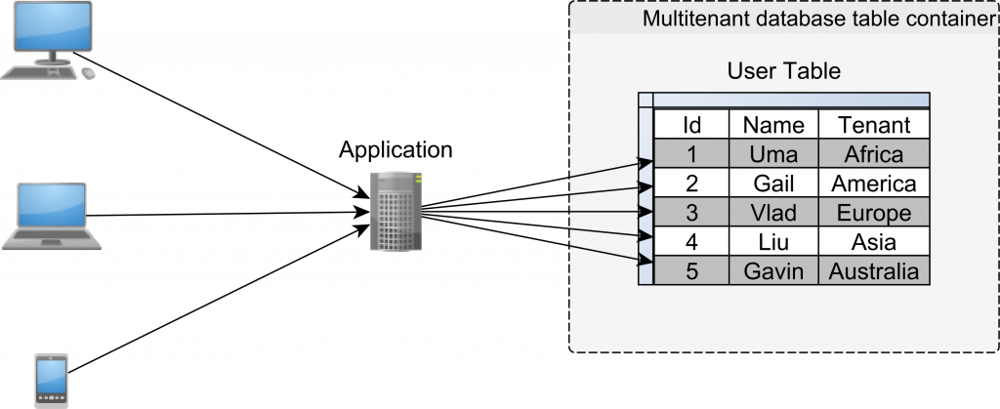

# Partitioned (Discriminator) Data – the data for each tenant is partitioned by a discriminator value

Multi-tenancy with partitioned (discriminator) data is a type of software architecture in which a single instance of a software application is shared among multiple tenants, or users, who are isolated from each other through the use of a discriminator column in the data model. The discriminator column is used to differentiate and segregate the data belonging to each tenant, allowing for data security and privacy among the tenants. This type of architecture is commonly used in cloud-based software-as-a-service (SaaS) applications where multiple businesses or organizations use the same application, but have their own data and settings within the application.



Architecture Image Credit : [Vlad](https://twitter.com/vlad_mihalcea)

## Notes

* Partitioned (Discriminator) Data is supported only from Hibernate 6.x and Spring boot 3.x, each discriminator is annotated with `@Tenant` which will be added to the where clause automatically using TenantIdentifier Resolver. `TenantIdentifierResolver.resolveCurrentTenantIdentifier()` is called while creating the Hibernate session, so the tenant should be set because it is called. To set tenant we are using `TenantInterceptor` to fetch the tenant from request and set to `TenantIdentifierResolver.setCurrentTenant()` for resolving the value
* The moment a new tenant is identified Hibernate Sequence Generator will increment its value by 50, refer `ApplicationIntegrationTest` class `testSequenceCollision` Junit

### Run tests
`$ ./mvnw clean verify`

### Run locally
```
$ docker-compose -f docker/docker-compose.yml up -d
$ ./mvnw spring-boot:run -Dspring-boot.run.profiles=local
```


### Useful Links
* Swagger UI: http://localhost:8080/swagger-ui.html
* Actuator Endpoint: http://localhost:8080/actuator

