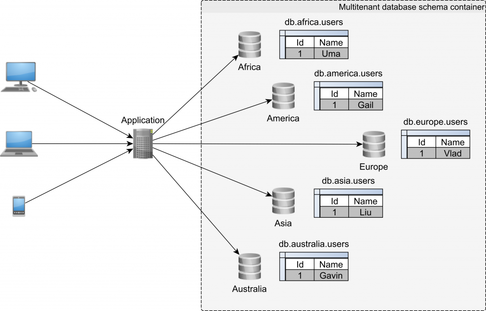

# schema

Multi-tenancy with different schema refers to a database architecture where a single database instance is used to store data for multiple tenants (i.e. clients or organizations), but each tenant has their own unique schema or set of tables and fields within the database. This allows each tenant to have their own distinct data structure and data management needs, while still benefiting from the shared resources and cost savings of a single database.



Architecture Image Credit : [Vlad](https://twitter.com/vlad_mihalcea)

### Run tests
`$ ./mvnw clean verify`

### Run locally
```
$ docker-compose -f docker/docker-compose.yml up -d
$ ./mvnw spring-boot:run -Dspring-boot.run.profiles=local
```


### Useful Links
* Swagger UI: http://localhost:8080/swagger-ui.html
* Actuator Endpoint: http://localhost:8080/actuator
