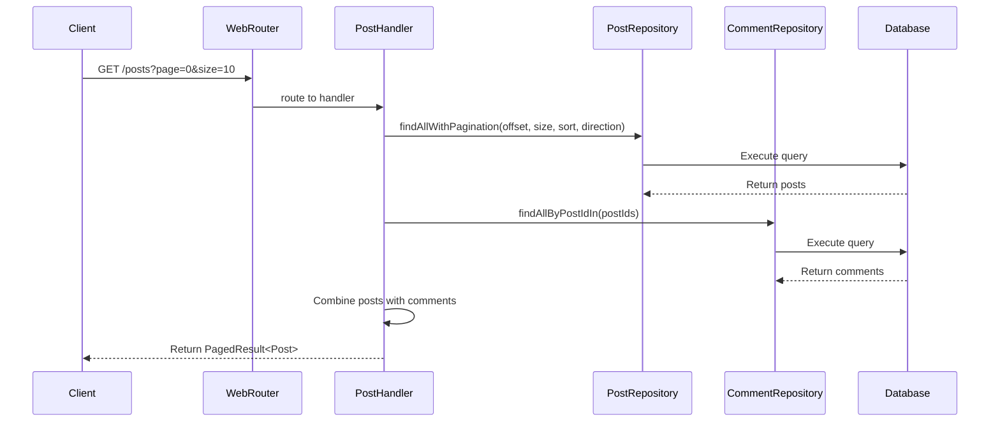

# Spring Boot R2DBC with JSON Column

This project demonstrates a reactive Spring Boot application using R2DBC with PostgreSQL JSON column support. It implements a blog-like system with posts and comments, featuring pagination and reactive endpoints.

---
## Features

- Reactive REST API using Spring WebFlux
- R2DBC with PostgreSQL for reactive database operations
- JSON column support for flexible data storage
- Flyway database migrations
- Pagination and sorting support
- Docker support with health checks
- Comprehensive test coverage using TestContainers
- Metrics and tracing with Micrometer
---
## Prerequisites

- JDK 21
- Docker and Docker Compose
- PostgreSQL 15+
---
## Getting Started

1. Clone the repository
2. Run PostgreSQL using Docker:
   ```bash
   docker-compose -f docker/docker-compose.yml up -d
   ```
3. Run the application.
   ```shell
   ./mvnw spring-boot:run
   ```

---

## API Endpoints

- `GET /posts?page=0&size=10&sort=title&direction=ASC` - Get paginated posts
- `GET /posts/{id}` - Get a specific post
- `POST /posts` - Create a new post
- `PUT /posts/{id}` - Update a post
- `DELETE /posts/{id}` - Delete a post
- `GET /posts/{postId}/comments` - Get comments for a post
- `POST /posts/{postId}/comments` - Add a comment to a post
---

## Architecture



---

## Running Tests

The project includes both unit and integration tests using TestContainers:

```bash
./mvnw verify
```

---

## Docker Deployment

Build and run the application using Docker:

```bash
./mvnw spring-boot:build-image
docker-compose -f docker/docker-compose-app.yml up -d
```

---

## Monitoring

The application exposes various actuator endpoints for monitoring:
- Health: `/actuator/health`
- Metrics: `/actuator/metrics`
- Info: `/actuator/info`

---

## Configuration

Key application properties can be configured in `application.properties`:
- Database connection settings
- Logging levels
- Jackson JSON settings
- Management endpoints
