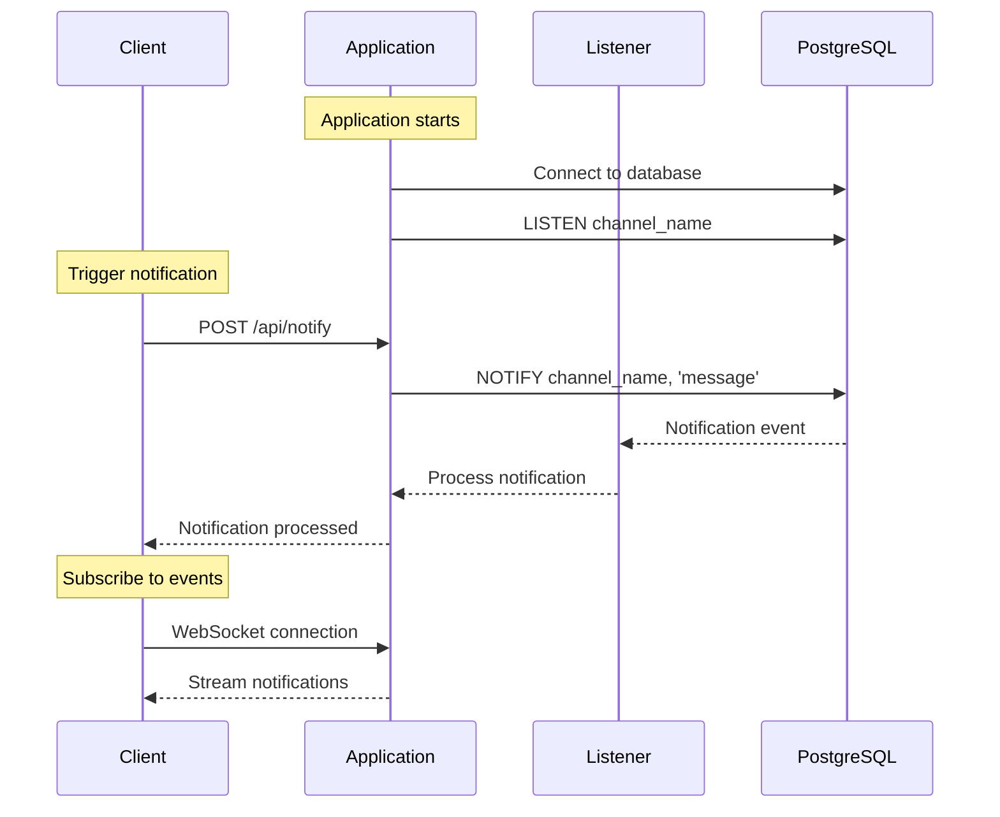

# Spring Boot R2DBC Notify/Listen Example

This project demonstrates how to implement PostgreSQL's NOTIFY/LISTEN feature using Spring Boot and R2DBC. It showcases real-time notifications between database and application using PostgreSQL's pub/sub capabilities.

---
## Features

- Reactive PostgreSQL connectivity using R2DBC
- Implementation of PostgreSQL NOTIFY/LISTEN mechanism
- Real-time event notifications
- Reactive endpoints for publishing and receiving notifications

---
## Prerequisites

- JDK 21
- Maven
- Docker and Docker Compose
- PostgreSQL (or use provided Docker Compose)

---

## Getting Started

1. Start PostgreSQL using Docker Compose:
   ```bash
   docker-compose up -d
   ```

2. Build the application:
   ```bash
   ./mvnw clean package
   ```

3. Run the application:
   ```bash
   ./mvnw spring-boot:run
   ```
---
## Architecture


---
## Usage

1. To publish a notification:
   ```bash
   curl -X POST http://localhost:8080/api/notify \
        -H "Content-Type: application/json" \
        -d '{"channel": "events", "message": "Hello World!"}'
   ```

2. To subscribe to notifications:
    - Connect to WebSocket endpoint: `ws://localhost:8080/notifications`
    - Or use Server-Sent Events endpoint: `http://localhost:8080/notifications/sse`

---

## Configuration

Key configuration properties in `application.properties`:

```properties
# R2DBC PostgreSQL Configuration
spring.r2dbc.url=r2dbc:postgresql://localhost:5432/postgres
spring.r2dbc.username=postgres
spring.r2dbc.password=postgres

# Notification Channel Configuration
app.notification.channel=events
```
---
## How It Works

1. The application establishes a connection to PostgreSQL using R2DBC
2. It sets up LISTEN on specified channels
3. When a notification is published:
    - Application executes NOTIFY command
    - PostgreSQL broadcasts to all listeners
    - Listeners receive and process notifications
4. Connected clients receive notifications via WebSocket/SSE

---
## Contributing

Feel free to submit issues and enhancement requests!
